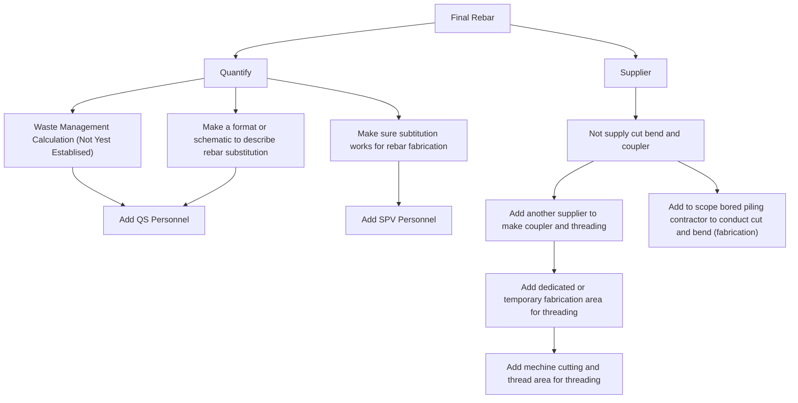

# Ishikawa Diagram for Final Rebar Issues

---

## Notes
This Ishikawa diagram identifies issues and solutions for the "Final Rebar" problem using Mermaid.js.
Ensure Mermaid rendering is enabled on GitHub for proper visualization.
